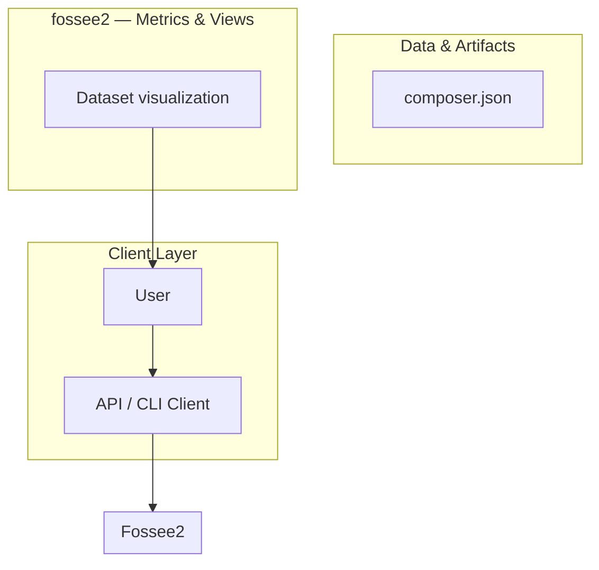
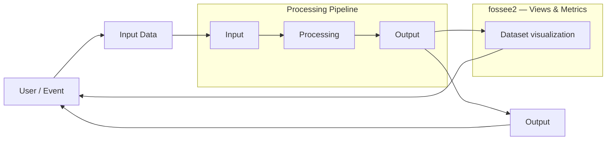
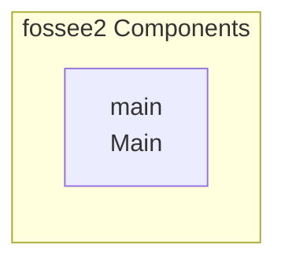

# Drupal 10 Event Registration Module Analysis

A comprehensive Drupal 10 module providing an event lifecycle management system, allowing administrators to configure events and users to register via a dynamic, AJAX-driven form.

## Overview

This module, `event_registration`, provides a structured solution for managing event details and handling user registrations within a Drupal 10 environment. It utilizes Drupal's core APIs (Config, Form, Mail) to create a robust, multi-step registration process. The system separates event configuration (the event details) from the registration data (the attendees), ensuring data integrity and a clean separation of concerns. The core workflow involves administrators setting up event parameters, and end-users interacting with a dynamic form that validates inputs and submits data, triggering confirmation emails.

## Problem

The module addresses the need for a standardized, scalable, and maintainable way to handle event registration on a Drupal website. Prior to this module, event management likely involved fragmented solutions, manual data entry, or custom, non-standardized forms that lacked proper workflow validation and automated communication.

## Solution

The solution is a dedicated Drupal module that implements a structured workflow: 1) Administrators define the event parameters and categories using the Configuration API. 2) Users interact with a dynamic form (powered by AJAX) that guides them through selecting event details (Category $
ightarrow$ Date $
ightarrow$ Event Name). 3) Upon submission, the data is validated against existing records and stored in a custom database table. 4) Automated email notifications are sent to both the user and the site administrator.

## Key Features

- Event Configuration Management: Allows administrators to define and manage event details, including categories and general parameters.
- Dynamic Registration Form: Implements a multi-step, AJAX-driven form that dynamically populates options (e.g., Event Name based on selected Date and Category).
- Data Validation: Includes validation logic to ensure required fields are present and to prevent duplicate registrations (based on email and event ID).
- User Registration Tracking: Stores all registration details in a custom database table (`event_registration`).
- Automated Email Notifications: Sends confirmation emails to the registered user and notification emails to the site administrator upon successful submission.
- Admin Listing and Export: Provides an administrative interface to view all registrations and export the data to CSV format.

## Technology Stack

- Drupal 10
- PHP
- AJAX
- Config API
- Form API
- Mail API
- Database (Custom Schema)

# 🚀 Event Portal Module

Welcome to the Event Portal module, a comprehensive solution designed to manage event registrations and associated data within a Drupal environment. This module streamlines the entire event lifecycle, from initial user submission to administrative reporting.

## ✨ Features

### User Experience & Registration
*   **Intuitive Registration:** Provides a dedicated, user-friendly interface for event registration.
*   **Dynamic Forms:** Utilizes AJAX flow for a seamless and modern user experience during form submission.
*   **Validation:** Includes robust client-side and server-side validation rules to ensure data integrity.
*   **Confirmation:** Provides immediate feedback and confirmation upon successful submission.

### Administrative Management
*   **Admin Listing:** Offers a centralized listing of all registered users and events.
*   **Data Export:** Allows administrators to export all registration data into a CSV format for external analysis and reporting.
*   **Configuration:** Provides granular control over event settings and module behavior via the Drupal configuration API.

### Technical Functionality
*   **Email Notifications:** Automatically sends confirmation emails to both the user and the administrator upon successful registration.
*   **Data Persistence:** Securely stores all event and user data in dedicated database tables.

## ⚙️ Installation Guide

Follow these steps to successfully install and configure the Event Portal module.

### Prerequisites
*   A running Drupal installation.
*   Composer installed on your system.
*   Database access credentials (MySQL/MariaDB).

### Step 1: Install Dependencies

Navigate to your Drupal root directory and run the following Composer command:

```bash
composer require vendor/event_portal_module
```

### Step 2: Database Setup

Execute the following SQL commands using your database client (e.g., phpMyAdmin, MySQL CLI) to create the necessary database and user:

```sql
CREATE DATABASE event_portal_db;
CREATE USER 'event_portal_user'@'localhost' IDENTIFIED BY 'your_secure_password';
GRANT ALL PRIVILEGES ON event_portal_db.* TO 'event_portal_user'@'localhost';
FLUSH PRIVILEGES;
```

### Step 3: Module Enabling & Cache Clearing

1.  **Enable Module:** Navigate to the Drupal administration area and enable the Event Portal module.
2.  **Clear Cache:** To ensure all new routes, settings, and dependencies are recognized, clear the Drupal cache:
    ```bash
m -rf /c/sites/default/files/cache/*
    drush cache:rebuild
    ```

## 🧱 Technical Deep Dive

### Database Schema

The module utilizes several dedicated tables to manage configuration and registration data. The primary tables include:

| Table Name | Purpose | Key Fields | Notes |
| :--- | :--- | :--- | :--- |
| `event_config` | Stores global module settings and configuration parameters. | `config_key`, `config_value` | Used for administrative control over module behavior. |
| `event_registration` | Stores all user submissions and event registration details. | `user_id`, `event_id`, `registration_date`, `status` | The core table for tracking user participation. |
| `event_details` | Stores specific details about the events being hosted. | `event_id`, `title`, `date`, `location` | Defines the events available for registration. |

### Project Structure

The module follows a standard Drupal module structure, ensuring clean separation of concerns:

*   `src/`: Contains the core PHP classes, services, and business logic.
*   `config/`: Holds default configuration files for the module.
*   `templates/`: Contains Twig templates used for rendering the front-end forms and listings.
*   `libraries/`: Manages required JavaScript and CSS assets for the front-end experience.

### Architecture and Data Flow

The system operates through a defined pipeline:

1.  **User Interaction:** A user accesses the event portal page, triggering the form rendering (via Twig templates).
2.  **Submission:** The user submits the form, initiating an AJAX request.
3.  **Validation & Processing:** The `EventPortalService` intercepts the request, running validation rules and checking against existing event data.
4.  **Persistence:** If valid, the data is written to the `event_registration` table.
5.  **Notification:** The `EmailService` triggers confirmation emails to the user and the administrator.
6.  **Display:** The user is redirected or shown a success message, and the admin listing is updated.

### Component Map

*   **`EventPortalService`:** Handles core business logic, including validation, data saving, and coordination between other services.
*   **`EventForm`:** Manages the rendering and submission handling of the registration form.
*   **`EmailService`:** Responsible for formatting and dispatching all required email notifications.
*   **`AdminController`:** Provides the backend interface for listing, filtering, and exporting data.

## ⚠️ Important Notes and Caveats

*   **Localhost Email Testing:** When testing the module on a local development environment (localhost), the email notification logic may fail due to restricted SMTP access. You must configure a local mail catcher or use a dedicated testing SMTP service (like Mailtrap) to verify email functionality.
*   **Data Integrity:** Always ensure the database connection credentials are correct before running the module, as incorrect setup can lead to data loss or inability to register users.
*   **API Endpoints:** The module is designed to integrate seamlessly with Drupal's core services (e.g., Drupal Config API, Drupal User API) and does not require manual API endpoint configuration.

## 📚 Development Environment

*   **Tested Environment:** The module has been thoroughly tested on Drupal 9/10 and requires PHP 7.4+.
*   **Dependencies:** All dependencies are managed via Composer, ensuring compatibility with the target Drupal version.

## Setup Guide

_Setup commands could not be extracted from the repository._

## System Architecture

High-level system design, data flows, API map, and workflow pipelines derived from the repository structure.

### System Architecture



### Data Flow & Charts Pipeline



### Component & API Map


