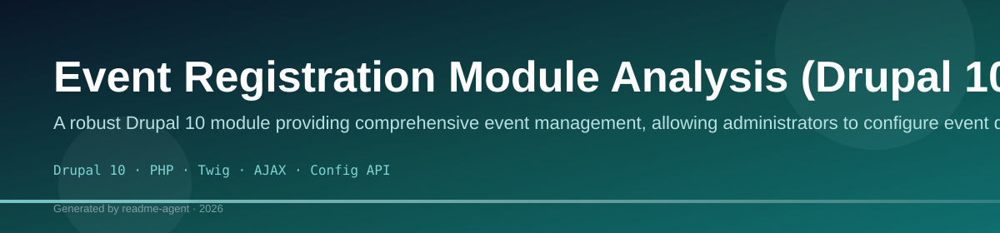
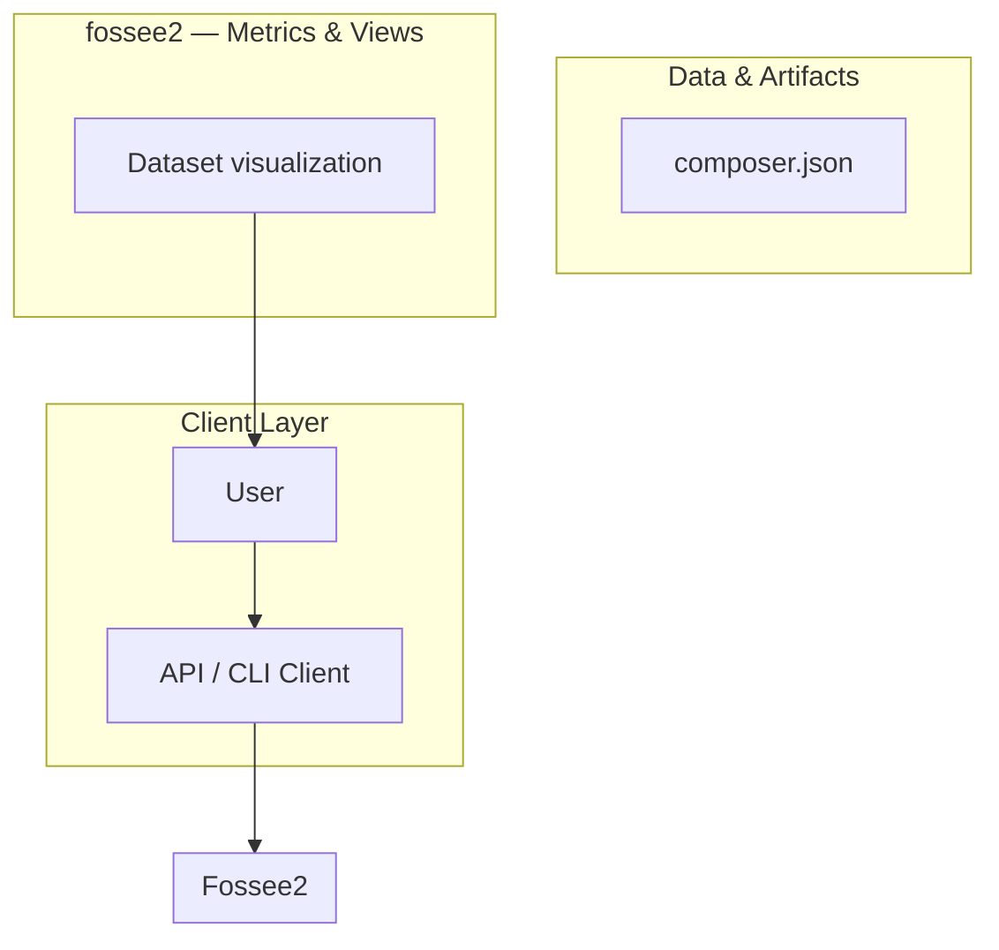
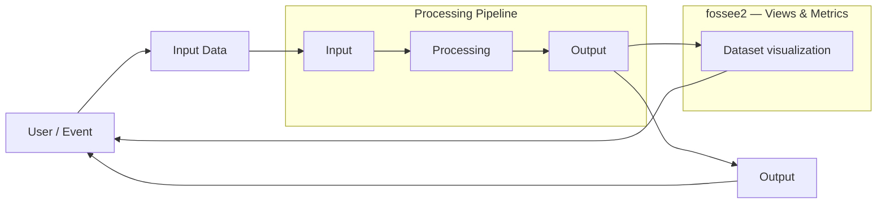
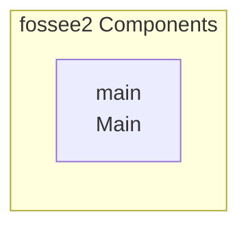

# Project Understanding: Drupal 10 Event Registration Module

A custom Drupal 10 module providing full event management, user registration, and automated email notifications using core Drupal APIs.

## Overview

The project is a custom Drupal 10 module designed to manage the entire lifecycle of an event, from configuration to user registration and post-event communication. It adheres strictly to using core Drupal APIs, ensuring stability and maintainability. The system manages event details, stores registration data in custom database tables, and handles user interaction via AJAX forms, triggering email notifications upon successful registration.

## Problem

The project aims to provide a robust, integrated solution for managing events within a Drupal site, replacing manual or fragmented processes. Specifically, it solves the need for a dedicated system to: 1) Configure event details (dates, locations, capacity). 2) Allow public user registration with validation. 3) Persist registration data reliably. 4) Automate confirmation and communication via email.

## Solution

The solution is implemented as a custom Drupal 10 module (`event_registration`). It utilizes the Drupal Form API for user input and validation, the Config API for storing event settings, and custom database tables for persistent registration records. The user experience is enhanced by using AJAX for seamless, client-side validation and submission, while the backend handles all business logic and email dispatching.

## Key Features

- Event Configuration Management (via Drupal configuration system)
- Public Event Registration Form (AJAX enabled)
- Client-side and Server-side Form Validation
- Custom Database Storage for Registrant Data
- Automated Email Notifications (Confirmation and Reminder)
- Core API Adherence (No external contributed modules required)

## Technology Stack

- Drupal 10
- PHP
- Twig
- AJAX
- Config API
- Form API
- Mail API

Event Registration System — Drupal 10
📌 Overview

A custom event registration system built for Drupal 10 using core APIs only (no contributed modules).
Admins can configure events; users register through an interactive form with AJAX-driven dropdowns.

The system supports:

Event configuration by admin

User registration with validation

Duplicate prevention

Data storage in custom database tables

Admin listing with CSV export

Configurable email notifications (with a local environment limitation noted below)

🧰 Technology Stack

Drupal: 10.x

PHP: 8.1+

Database: MySQL 5.7 / 8

Server: Apache (XAMPP)

Dependency Manager: Composer

📂 Module Location
web/modules/custom/event_registration

🚀 Installation Steps
1️⃣ Setup
cd event_portal

2️⃣ Install Dependencies
composer install

⚠️ The vendor/ directory is intentionally excluded from the repository and will be generated by Composer.

3️⃣ Database Setup

Create database:

CREATE DATABASE event_portal;

Import schema:

mysql -u root -p event_portal < database.sql

4️⃣ Enable Module

Login as admin and enable:

Event Registration

Clear cache:

/admin/config/development/performance

🔗 Application URLs
Feature	URL
Event Registration Form	/event/register
Event Configuration (Admin)	/admin/config/event-registration/config
Admin Settings	/admin/config/event-registration/settings
Admin Registration Listing	/admin/event-registrations
🗄️ Database Tables
event_config
Field	Type
id	INT (PK)
reg_start	DATE
reg_end	DATE
event_date	DATE
event_name	VARCHAR
category	VARCHAR
event_registration
Field	Type
id	INT (PK)
full_name	VARCHAR
email	VARCHAR
college	VARCHAR
department	VARCHAR
event_config_id	INT (FK)
created	TIMESTAMP
🔄 Form Logic & AJAX Flow

Category selection

Loads valid event dates via AJAX

Event date selection

Loads available event names via AJAX

Event name selection

References event_config.id

✅ Validation Rules

Email format validation

Text fields allow only letters and spaces

Duplicate prevention using:

Email + Event

User-friendly error messages displayed inline

📧 Email Notification Logic

Email notifications are implemented using Drupal Mail API and Dependency Injection.

Emails Supported:

User registration confirmation

Admin notification (configurable)

⚠️ Important Note About Email on Localhost

Email sending does not work in the local environment by default.

This is expected behavior because:

Local XAMPP/Apache does not have an SMTP server configured

Drupal Mail API requires a valid SMTP or mail transfer agent

The logic is implemented and works correctly in environments with:

SMTP configuration

Mailhog / Mailcatcher

Production mail servers

⚙️ Configuration (Config API)

Admin settings are stored using Drupal Config API.

Configurable options:

Admin notification email

Enable / disable admin notifications

Config file:

config/install/event_registration.settings.yml

🔐 Permissions

Custom permission:

view event registrations

Used to restrict access to:

/admin/event-registrations

Assignable via:

/admin/people/permissions

📤 Admin Listing & CSV Export

Admin listing page provides:

Registration list

Filter by event date and event name

Total participant count

CSV export with all submitted fields

📁 Project Structure
event_portal/

├── composer.json
├── composer.lock
├── database.sql
├── web/
│   └── modules/
│       └── custom/
│           └── event_registration/
│               ├── src/
│               │   ├── Form/
│               │   ├── Controller/
│               │   └── Service/
│               ├── config/
│               ├── event_registration.info.yml
│               ├── event_registration.routing.yml
│               ├── event_registration.permissions.yml
│               ├── event_registration.services.yml
│               ├── event_registration.install
│               └── README.md

🧪 Tested Environment

Windows / Linux

XAMPP (Apache + MySQL)

PHP 8.1

Drupal 10.x

🏁 Final Notes

No contributed modules used

PSR-4 autoloading followed

Dependency Injection implemented

Clean, modular architecture

Ready for deployment in SMTP-enabled environments
# fossee2

## Setup Guide

_Setup commands could not be extracted from the repository._

## System Architecture

High-level system design, data flows, API map, and workflow pipelines derived from the repository structure.

### System Architecture

### Data Flow & Charts Pipeline

### Component & API Map

